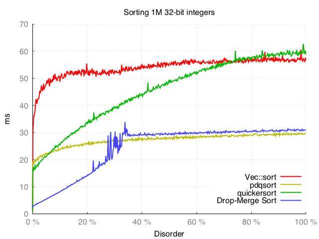
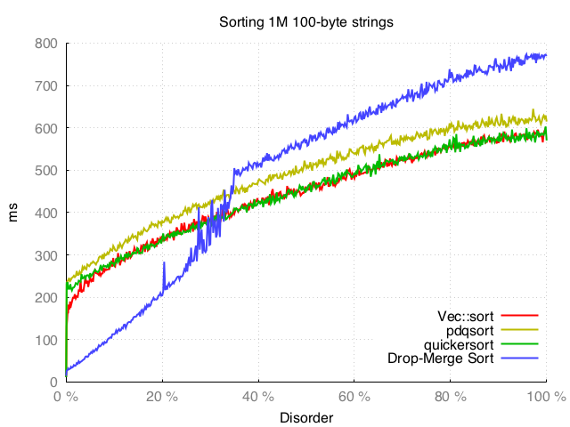

# Abstract
This is an implementation of a novel [adaptive sorting](https://en.wikipedia.org/wiki/Adaptive_sort) algorithm optimized for nearly-sorted data. Drop-Merge sort is especially useful for when >80% of the data is already in-order, and the unsorted elements are evenly distributed. An example use-case would be re-sorting an already sorted list after minor modifications.

Drop-Merge sort is 2-5 times faster than quicksort when sorting long lists (10k elements or more) in cases where >80% of the data is already in order, while being considerably simpler to implement than other adaptive sorting algorithms.

With `N` elements in the list where `K` elements are out-of-order, Drop-Merge sort performs `O(N + K⋅log(K))` comparisons and use `O(K)` extra memory.

Definition: X% of elements are in order if the [Longest Nondecreasing Subsequence](https://en.wikipedia.org/wiki/Longest_increasing_subsequence) contains X% of the elements.

# Getting started with the crate
Add this to `Cargo.toml`:
```
[dependencies]
dmsort = "0.1.3"
```

And then use it:
``` rust
extern crate dmsort;

fn main() {
	let mut numbers : Vec<i32> = vec!(0, 1, 6, 7, 2, 3, 4, 5);
	dmsort::sort(&mut numbers);
	assert_eq!(numbers, vec!(0, 1, 2, 3, 4, 5, 6, 7));
}
```

[Full dmsort documentation](https://emilk.github.io/drop-merge-sort/dmsort/index.html).

# Performance
To test the performance of this algorithm, I generate almost-sorted data like this (pseudo-code):

```
function generate_test_data(length, disorder_factor) -> Vec {
	result = Vec::new()
	for i in 0..length {
		if random_float() < disorder_factor {
			result.push(random_integer_in_range(0, length))
		} else {
			result.push(i)
		}
	}
	return result
}
```

I then benchmarked Drop-Merge sort against:

* the default Rust sorting algorithm ([Vec::sort](https://doc.rust-lang.org/beta/std/vec/struct.Vec.html#method.sort), a [stable sorting algorithm](https://github.com/rust-lang/rust/pull/38192) based loosely on [Timsort](https://en.wikipedia.org/wiki/Timsort))
* [pdqsort (pattern-defeating quicksort)](https://github.com/stjepang/pdqsort)
* [quickersort (dual-pivot quicksort)](https://github.com/notriddle/quickersort)

The benchmark was run on an MacBook Pro Retina (Early 2013) using `rustc 1.15.0 (10893a9a3 2017-01-19)`.




We can see that all four algorithms manages to exploit almost-sorted data, but Drop-Merge sort wins out when the disorder factor is less than 30% (more than 70% of the elements are in order).

It also behaves well when the data becomes more random, and at its worst it is still only ~30% slower than pdqsort (which Drop-Merge sort uses as fallback).

Here is another view of the data for 0-50% disorder:


Here we can see that we get 5x speedup over quicksort when 99% of the elements are in order, and a 2x speedup when 85% of the elements are in order.

When the disorder is above 30% (less than 70% of the elements are in order), Drop-Merge sort is slower than its competitors.

# Algorithm details
## Background
The paper [Item Retention Improvements to Dropsort, a Lossy Sorting Algorithm](http://micsymposium.org/mics_2011_proceedings/mics2011_submission_13.pdf) by Abram Jackson and Ryan McCulloch introduced improvements to the esoteric "lossy" sorting algorithm known as [*Dropsort*](http://www.dangermouse.net/esoteric/dropsort.html). In Dropsort, out-of-order elements are simply "dropped" (i.e. removed). In the paper, Jackson et al. introduced improvements to Dropsort which improved the detection of out-of-order elements so that more elements would be kept, and fewer dropped.

Although the paper does not spell it out, it does in fact describe a fast `O(N)` algorithm for finding an approximate solution to the [Longest Nondecreasing Subsequence](https://en.wikipedia.org/wiki/Longest_increasing_subsequence) (LNS) problem. The algorithm is very effective when a majority of elements in a list is in order (part of the LNS).

Example input, where most of the data is in order:


## Drop-Merge sort
The main idea in Drop-Merge sort is this:

* Use the methods described in the Jackson et al. paper to find the Longest Nondecreasing Subsequence (LNS).
* Keep the LNS and drop the outliers into a separate list.
* Sort the list of dropped outliers using a standard sorting algorithm ([pdqsort](https://github.com/stjepang/pdqsort), in this implementation).
* Merge the outliers back into the main list of the already sorted LNS.

Thus despite its heritage, Drop-Merge sort is a *lossless* sorting algorithm (the normal kind).

## Finding the Longest Nondecreasing Subsequence
The implementation uses the idea of *memory* from the Jackson et al. paper to detect *mistakes* - elements that probably should have been dropped instead of accepted. Consider the following sequence of numbers:

`0 1 12 3 4 5 6 7 8 9`

The naïve Dropsort algorithm will accept `0 1 12` and then drop the remaining values (as they are all smaller than 12). The idea of memory is to detect when we have dropped a certain number of elements in a row. When this happens, we roll-back and drop the last element before the long run of drops. This is a form of back-tracking which solves the above problem. In the case of the input above, the algorithm will drop the `12` and keep all other elements. In this implementation, we consider the dropping of 8 elements in a row to be the cutoff point at which we roll-back and undo. This contains the assumption that there will be no more than 8 outliers in a row. It is a very simple method that works well in practice.

Drop-Merge sort will keep in-order elements in situ, moving them towards the start of the list. This helps keep the memory use down and the performance up.

If the elements are not ordered Drop-Merge sort can be around 10% slower than a traditional sorting algorithm. Therefore Drop-Merge sort will try to detect such disordered input and abort, falling back to the standard sorting algorithm.

## Comparison to other adaptive sorting algorithms
An adaptive sorting algorithm is one that can exploit existing order. These algorithms ranges from the complicated to the simple.

On the complicated end there is the famous [Smoothsort](https://en.wikipedia.org/wiki/Smoothsort), which seems, however, to be quite unpopular - probably due to its complexity. I failed to find a good implementation of Smoothsort to compare Drop-Merge sort against. [Timsort](https://en.wikipedia.org/wiki/Timsort) is a more modern and popular adaptive sorting algorithm. It needs long spans of nondecreasing elements to compete with the performance of Drop-Merge sort. The standard Rust sort uses a variant of Timsort, and as you can see from the performance comparisons, Drop-Merge sort wins for the nearly-sorted cases for which it was designed.

On the simple end of the spectrum there are `O(N²)` algorithms that perform extremely well when there are only one or two elements out of place, or the list is very short (a few hundred elements at most). Examples include [Insertion sort](https://en.wikipedia.org/wiki/Insertion_sort) and [Coctail sort](https://en.wikipedia.org/wiki/Cocktail_shaker_sort).

Drop-Merge sort finds an interesting middle-ground – it is reasonably simple (less than 100 lines of code), yet manages to perform well for long lists. Note, however, that Drop-Merge sort depends on another sorting algorithm (e.g. quick-sort) for sorting the out-of-order elements.

## When Drop-Merge sort works best
* Less than 20-30% of the elements out of order AND these are randomly distributed in the data (not clumped).
* You have a lot of data (10k elements or more, and definitively when you get into the millions).


## Limitations and future work
Drop-Merge sort is not stable, which means it will not keep the order of equal elements.

Drop-Merge sort does not sort [in-situ](https://en.wikipedia.org/wiki/In-place_algorithm), but will use `O(K)` extra memory, where `K` is the number of elements out-of-order.

The algorithms uses `recency=8` which means it can handle no more than 8 outliers in a row. This number was chosen by experimentation, and could perhaps be adjusted dynamically for increased performance.

# Other implementations
* C++: [https://github.com/adrian17/cpp-drop-merge-sort](https://github.com/adrian17/cpp-drop-merge-sort)


## TODO
* Set up TravisCI
